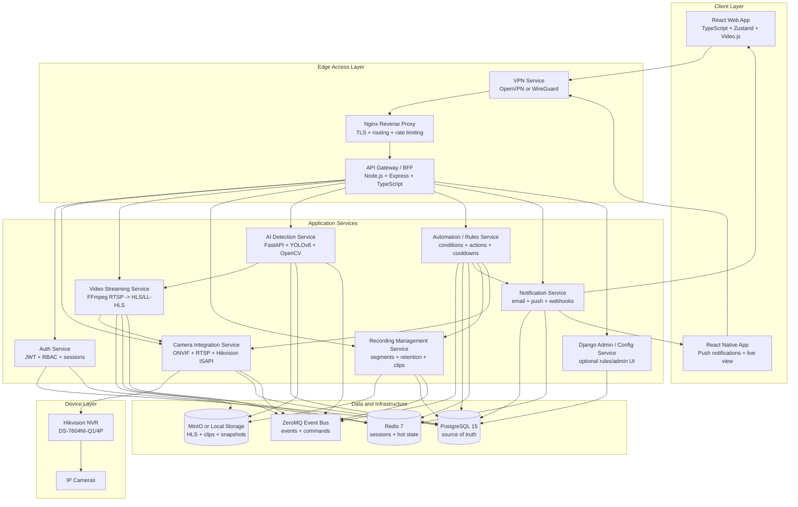
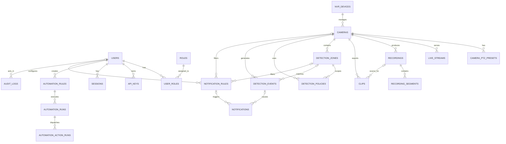
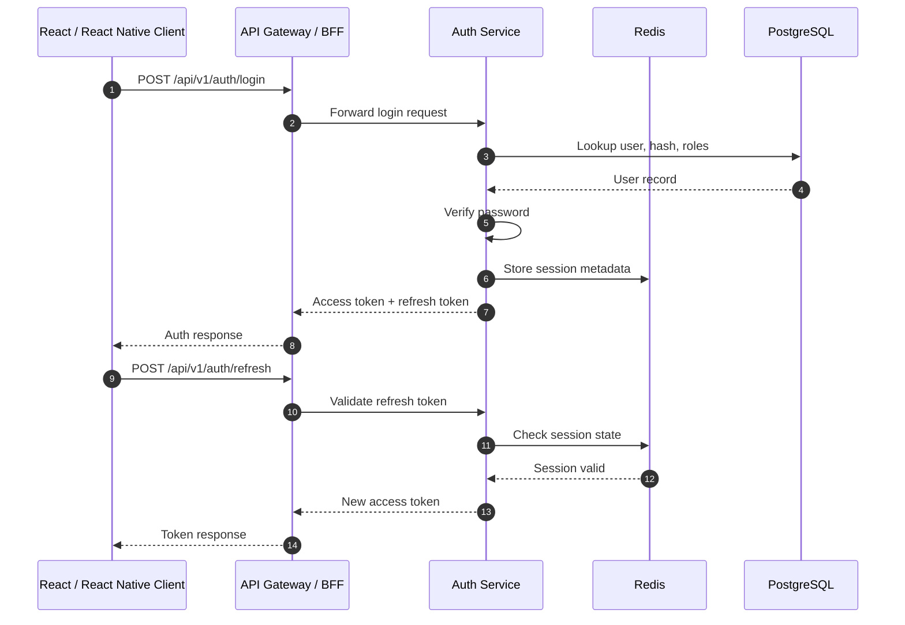
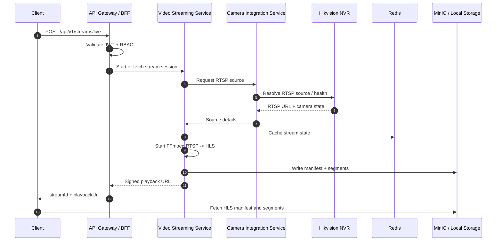
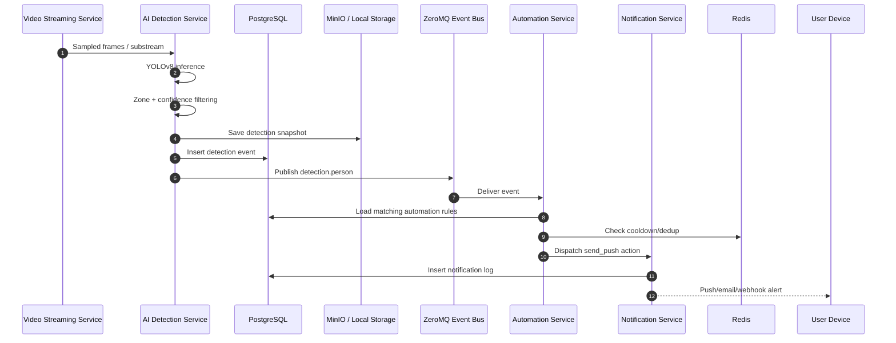
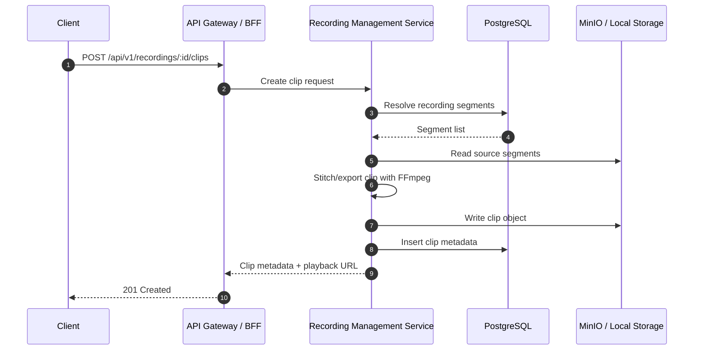

# Security System Baseline Architecture

## 1. Overview

This document defines the baseline architecture for a locally hosted security system intended to replace ADT Pulse. The system integrates with a Hikvision DS-7604NI-Q1/4P NVR and supports live monitoring, historical playback, local recording, AI-powered person detection, automation rules, notifications, and secure remote access.

The architecture is designed for a homelab or local server deployment first, with enough modularity to evolve into a larger microservices system later.

## 2. Architecture Goals

- Replace ADT Pulse-style monitoring with a locally controlled system.
- Support React web and React Native mobile clients.
- Integrate with Hikvision NVR/cameras using RTSP, ONVIF, and Hikvision ISAPI where needed.
- Provide live video viewing through browser/mobile-compatible streaming.
- Record scheduled, manual, and motion/detection-triggered video.
- Run real-time or near-real-time AI person detection using YOLOv8.
- Support detection zones, confidence thresholds, alert filtering, and automation rules.
- Keep sensitive camera/video data local by default.
- Provide secure remote access through VPN-first networking.
- Maintain a clear audit trail for user actions, detections, automations, and notifications.

## 3. Key Design Decision

The system should be treated as a **modular local platform** with service boundaries. For phase 1, these services may run as separate containers in Docker Compose, but they do not all need to be independently deployed microservices immediately.

Recommended phase 1 approach:

- Node.js/Express/TypeScript for the API Gateway/BFF and general application services.
- FastAPI for AI inference and high-throughput Python runtime APIs.
- Django for admin/config/rules only if the project needs a richer internal admin panel.
- PostgreSQL as the source of truth.
- Redis for hot state, sessions, cooldowns, and stream state.
- ZeroMQ as a lightweight local event bus.
- FFmpeg for RTSP to HLS/LL-HLS conversion and recording segmentation.
- MinIO or local filesystem for video object storage.
- OpenVPN/WireGuard for remote access.

## 4. High-Level Architecture



## 5. Runtime Flow Summary

### 5.1 Login Flow

```text
React / React Native
    -> VPN
    -> Nginx
    -> API Gateway
    -> Auth Service
    -> PostgreSQL / Redis
    -> JWT + refresh token returned to client
```

### 5.2 Live Video Flow

```text
Client requests live stream
    -> API Gateway validates JWT/RBAC
    -> Video Streaming Service requests RTSP source
    -> Camera Integration Service resolves NVR/camera stream
    -> FFmpeg converts RTSP to HLS/LL-HLS
    -> HLS manifest/segments written to MinIO/local storage
    -> client receives signed playback URL
```

### 5.3 Recording Flow

```text
Schedule, manual command, motion event, or automation rule
    -> Recording Management Service
    -> FFmpeg writes segmented video
    -> segments stored in MinIO/local storage
    -> recording metadata stored in PostgreSQL
```

### 5.4 AI Detection Flow

```text
Video stream or sampled frames
    -> AI Detection Service
    -> YOLOv8 inference
    -> zone filtering + confidence threshold
    -> detection event stored in PostgreSQL
    -> snapshot stored in MinIO/local storage
    -> detection.person event published to ZeroMQ
    -> Automation/Notification services react
```

### 5.5 Automation Flow

```text
Event or schedule trigger
    -> Automation Service evaluates active rules
    -> Redis cooldown/dedup check
    -> actions dispatched
    -> notification, recording, camera preset, webhook, or policy change
    -> automation run logged in PostgreSQL
```

## 6. Core Components

### 6.1 React Web Application

**Stack**

- React 18
- TypeScript
- Zustand
- Tailwind CSS
- Headless UI
- Video.js
- Recharts
- Lucide React

**Responsibilities**

- Live camera dashboard.
- Historical playback timeline.
- AI detection event timeline.
- Camera management.
- Detection zone drawing.
- Recording and clip export UI.
- User, role, and permission screens.
- Automation rule builder.
- Alert and notification preferences.
- System health dashboard.

### 6.2 React Native Mobile Application

**Responsibilities**

- Live camera viewing.
- Push notifications.
- Alert acknowledgement.
- Detection snapshots.
- Clip playback.
- Home/away mode toggling.
- Basic camera status monitoring.

The mobile app should use the same API Gateway as the web app but may receive smaller payloads and mobile-optimized playback URLs.

### 6.3 API Gateway / BFF

**Recommended stack**: Node.js 20 LTS + Express + TypeScript.

**Responsibilities**

- Single public API surface for web and mobile clients.
- JWT validation.
- RBAC enforcement.
- Request routing to internal services.
- Response aggregation.
- Signed URL generation for video playback.
- WebSocket connection management for live alerts/status.
- API rate limiting.
- Audit correlation IDs.

The gateway prevents the frontend from needing to know every internal service address.

### 6.4 Authentication Service

**Recommended stack**: Node.js + Express + TypeScript, or FastAPI if the backend is kept Python-first.

**Responsibilities**

- User login/logout.
- JWT access tokens.
- Refresh token rotation.
- API key management.
- RBAC role/permission lookup.
- Session revocation.
- Optional MFA in the future.

### 6.5 Camera Integration Service

**Recommended stack**: Node.js + TypeScript or FastAPI.

**Responsibilities**

- Hikvision NVR integration.
- ONVIF device discovery.
- RTSP stream discovery.
- Hikvision ISAPI support for camera-specific controls.
- PTZ control where supported.
- Motion event ingestion.
- Camera health checks.
- NVR sync.

This service is the system boundary around physical camera hardware.

### 6.6 Video Streaming Service

**Recommended stack**: Node.js + FFmpeg workers, or FastAPI + FFmpeg workers.

**Responsibilities**

- RTSP ingestion.
- RTSP to HLS/LL-HLS conversion.
- Optional transcoding or remuxing.
- Multi-resolution stream support.
- Live playback session lifecycle.
- Stream health and restart handling.
- Writing HLS manifests/segments to storage.

Important design note: Prefer **remuxing** when possible and only transcode when browser/mobile compatibility or bitrate control requires it.

### 6.7 Recording Management Service

**Recommended stack**: Node.js + TypeScript, or FastAPI if Python-first.

**Responsibilities**

- Scheduled recording.
- Manual recording.
- Motion-triggered recording.
- AI-triggered recording.
- Segment indexing.
- Retention policy execution.
- Clip creation and export.
- Video metadata extraction.

### 6.8 AI Detection Service

**Recommended stack**: FastAPI + Python workers + PyTorch + YOLOv8 + OpenCV.

**Responsibilities**

- Consume sampled frames or lower-resolution substreams.
- Run person detection using YOLOv8.
- Apply confidence thresholds.
- Apply detection-zone polygon filtering.
- Deduplicate overlapping detections.
- Store detection metadata.
- Save snapshots.
- Publish detection events.

Important design note: Use substreams or sampled frames for AI first. Avoid running full-resolution inference on every frame unless the hardware can support it.

### 6.9 Django Admin / Config Service

**Recommended stack**: Django + Django REST Framework, optional.

**Responsibilities**

- Admin/config dashboards.
- Detection zone management.
- Detection policies.
- Automation rules.
- Retention policies.
- Internal administrative CRUD.

Django is optional. If the project does not need a full admin backend yet, FastAPI can handle these APIs in phase 1.

### 6.10 Automation / Rules Service

**Recommended stack**: Node.js + TypeScript or Python + FastAPI worker.

**Responsibilities**

- Subscribe to ZeroMQ events.
- Evaluate event-based, schedule-based, and state-based rules.
- Check quiet hours, cooldowns, and suppressions.
- Dispatch actions to other services.
- Log automation runs and action results.

Example rule:

```json
{
  "name": "Night front door person alert",
  "trigger": {
    "type": "event",
    "eventType": "detection.person"
  },
  "conditions": [
    { "field": "cameraId", "operator": "equals", "value": "front_door" },
    { "field": "confidence", "operator": "gte", "value": 0.85 },
    { "field": "time", "operator": "between", "value": ["22:00", "06:00"] }
  ],
  "actions": [
    { "type": "send_push", "message": "Person detected at front door" },
    { "type": "start_recording", "durationSeconds": 60 },
    { "type": "create_clip", "preRollSeconds": 10, "postRollSeconds": 30 }
  ],
  "cooldownSeconds": 120
}
```

Initial action types:

- `send_push`
- `send_email`
- `call_webhook`
- `start_recording`
- `create_clip`
- `enable_detection_policy`
- `disable_detection_policy`
- `set_camera_preset`
- `set_home_mode`

### 6.11 Notification Service

**Recommended stack**: Node.js + TypeScript or FastAPI.

**Responsibilities**

- Email notifications.
- Mobile push notifications.
- Webhook delivery.
- Alert deduplication.
- Quiet hours.
- Alert escalation.
- Notification delivery logs.

### 6.12 VPN Service

**Recommended stack**: WireGuard or OpenVPN.

**Responsibilities**

- Secure remote access.
- Certificate/key management.
- Remote client access logs.
- Prevent direct public exposure of internal services.

WireGuard is usually simpler and faster. OpenVPN is still valid and widely supported.

## 7. Functional Requirements

### 7.1 User Management and Authentication

- Users can log in and log out.
- Users receive JWT access tokens and refresh tokens.
- Users can have one or more roles.
- Roles determine access to cameras, recordings, admin pages, and automation rules.
- API keys can be created for trusted external integrations.
- Sessions can be revoked.

### 7.2 Camera Integration and Control

- The system integrates with Hikvision NVRs.
- Cameras can be discovered through ONVIF where supported.
- RTSP streams are managed centrally.
- PTZ commands are supported where available.
- Camera/NVR health is monitored.
- Motion events can be ingested and published as internal events.

### 7.3 Live Video Streaming

- Users can view live camera streams through web and mobile clients.
- RTSP streams are converted into HLS or LL-HLS.
- Stream access must be authenticated.
- The system supports signed playback URLs.
- The system supports lower-resolution mobile/substream playback.

### 7.4 Recording and Playback

- The system supports scheduled recording.
- The system supports manual recording.
- The system supports motion-triggered recording.
- The system supports AI-triggered recording.
- Recordings are segmented and indexed.
- Users can search recordings by camera and time range.
- Users can create and export clips.
- Retention policies remove old recordings based on age, storage pressure, or camera-specific rules.

### 7.5 AI Person Detection

- The system runs YOLOv8 person detection.
- AI inference can use sampled frames or low-resolution substreams.
- Detection zones are configurable per camera.
- Detection events include timestamp, confidence, camera, zone, object type, and optional snapshot.
- Detection thresholds are configurable.
- Detection events can trigger automation rules.

### 7.6 Automation

- Users can create rules based on events, schedules, or system state.
- Rules can evaluate camera, zone, confidence, time, home/away mode, and cooldown conditions.
- Rules can trigger notifications, recordings, clips, webhooks, camera presets, or detection-policy changes.
- Automation runs are logged for auditability.

### 7.7 Notifications and Alerts

- Users can receive alerts by email, mobile push, and webhook.
- Alerts can be filtered by camera, zone, event type, time, confidence, and home/away mode.
- Alerts can be suppressed by cooldowns and quiet hours.
- Notification attempts and failures are logged.

### 7.8 Remote Access

- Remote access should go through VPN by default.
- The API and video playback endpoints should not be publicly exposed without VPN.
- External webhooks are allowed only through explicit user configuration.

## 8. Non-Functional Requirements

### 8.1 Security

- VPN-first remote access.
- TLS for browser/mobile/API traffic.
- Internal service traffic should use private networking and can use TLS where practical.
- JWT-based auth with refresh token rotation.
- RBAC enforced at the gateway and service layer for sensitive actions.
- Signed URLs for video playback.
- Rate limiting at Nginx/API Gateway.
- Input validation for all APIs.
- SQL injection prevention through parameterized queries/ORM.
- XSS/CSRF protections for web UI.
- Video storage encryption at rest where supported.
- Secret management for NVR credentials, JWT secrets, API keys, SMTP credentials, and push credentials.
- Full audit logs for login, config changes, exports, automation runs, and admin actions.

### 8.2 Performance

- Live streaming should be low-latency enough for monitoring.
- AI should run near real time, but can drop frames under load instead of blocking stream playback.
- AI should use substreams/sampled frames first to reduce GPU/CPU pressure.
- Stream state should be cached in Redis.
- Frequently accessed camera metadata should be cached.
- PostgreSQL should use indexes on camera/time/event queries.

### 8.3 Reliability

- Services expose `/health` endpoints.
- FFmpeg processes are supervised and restarted if needed.
- Camera health checks run periodically.
- Failed notification deliveries are retried with backoff.
- Automation actions are idempotent where possible.
- Recording metadata and object storage should be reconciled periodically.
- Backups cover PostgreSQL, configuration, and important exports.

### 8.4 Scalability

- Services should be stateless where possible.
- Video and AI workers can scale independently.
- PostgreSQL remains the source of truth.
- Redis stores temporary/hot state only.
- ZeroMQ is suitable for local eventing; RabbitMQ/Kafka can replace it if durable replay is needed later.

### 8.5 Maintainability

- Docker Compose for phase 1.
- Consistent environment variable configuration.
- Structured JSON logging.
- Request IDs propagated across services.
- Clear service ownership boundaries.
- OpenAPI documentation for public APIs.
- Database migrations managed through a migration tool.

## 9. Technology Stack

### 9.1 Frontend

- React 18 with TypeScript.
- React Native for mobile.
- Zustand for client state.
- Tailwind CSS and Headless UI.
- Video.js for HLS playback.
- Recharts for analytics.
- Lucide React for icons.

### 9.2 Backend

- Node.js 20 LTS.
- Express.js with TypeScript.
- FastAPI for Python inference/runtime APIs.
- Django or Django REST Framework for optional admin/config services.
- PostgreSQL 15.
- Redis 7.
- ZeroMQ.
- FFmpeg.

### 9.3 AI/ML

- PyTorch.
- YOLOv8.
- OpenCV.
- Optional GPU acceleration with CUDA-capable NVIDIA GPU.

### 9.4 Infrastructure

- Docker + Docker Compose for local deployment.
- Nginx reverse proxy.
- WireGuard or OpenVPN for VPN access.
- MinIO or local filesystem storage.
- Prometheus + Grafana for metrics.
- Loki/Grafana or ELK for logs.

## 10. Data Storage Strategy

### 10.1 PostgreSQL

PostgreSQL stores metadata and system state:

- users
- roles
- sessions
- cameras
- NVR devices
- stream sessions
- recordings
- recording segments
- clips
- detection zones
- detection policies
- detection events
- automation rules
- automation runs
- notification rules
- notification logs
- audit logs

### 10.2 Redis

Redis stores short-lived state:

- active sessions/session cache
- stream session state
- active viewer counts
- notification cooldown keys
- automation dedup keys
- camera heartbeat cache
- short-lived signed URL metadata

Redis is not the source of truth.

### 10.3 MinIO or Local Filesystem

Stored objects:

- HLS manifests
- video segments
- recording files
- exported clips
- detection snapshots
- temporary transcode output

Example object paths:

```text
recordings/camera-front-door/2026/04/25/13/segment-000123.ts
clips/camera-front-door/2026/04/25/clip-uuid.mp4
snapshots/camera-front-door/2026/04/25/detection-event-uuid.jpg
hls/live/stream-id/index.m3u8
```

## 11. Database Schema Baseline

### 11.1 Identity Tables

```sql
CREATE TABLE users (
  id UUID PRIMARY KEY,
  email VARCHAR(255) UNIQUE NOT NULL,
  password_hash TEXT NOT NULL,
  full_name VARCHAR(255),
  is_active BOOLEAN NOT NULL DEFAULT TRUE,
  created_at TIMESTAMPTZ NOT NULL DEFAULT NOW(),
  updated_at TIMESTAMPTZ NOT NULL DEFAULT NOW()
);

CREATE TABLE roles (
  id UUID PRIMARY KEY,
  name VARCHAR(100) UNIQUE NOT NULL,
  description TEXT
);

CREATE TABLE user_roles (
  user_id UUID NOT NULL REFERENCES users(id) ON DELETE CASCADE,
  role_id UUID NOT NULL REFERENCES roles(id) ON DELETE CASCADE,
  PRIMARY KEY (user_id, role_id)
);

CREATE TABLE api_keys (
  id UUID PRIMARY KEY,
  user_id UUID NOT NULL REFERENCES users(id) ON DELETE CASCADE,
  key_hash TEXT NOT NULL,
  name VARCHAR(255) NOT NULL,
  last_used_at TIMESTAMPTZ,
  expires_at TIMESTAMPTZ,
  created_at TIMESTAMPTZ NOT NULL DEFAULT NOW()
);

CREATE TABLE sessions (
  id UUID PRIMARY KEY,
  user_id UUID NOT NULL REFERENCES users(id) ON DELETE CASCADE,
  refresh_token_hash TEXT NOT NULL,
  user_agent TEXT,
  ip_address INET,
  expires_at TIMESTAMPTZ NOT NULL,
  revoked_at TIMESTAMPTZ,
  created_at TIMESTAMPTZ NOT NULL DEFAULT NOW()
);
```

### 11.2 Camera Tables

```sql
CREATE TABLE nvr_devices (
  id UUID PRIMARY KEY,
  name VARCHAR(255) NOT NULL,
  vendor VARCHAR(100),
  model VARCHAR(100),
  host VARCHAR(255) NOT NULL,
  port INT NOT NULL,
  username VARCHAR(255),
  encrypted_credentials TEXT,
  status VARCHAR(50) NOT NULL DEFAULT 'unknown',
  last_seen_at TIMESTAMPTZ,
  created_at TIMESTAMPTZ NOT NULL DEFAULT NOW()
);

CREATE TABLE cameras (
  id UUID PRIMARY KEY,
  nvr_device_id UUID REFERENCES nvr_devices(id) ON DELETE SET NULL,
  name VARCHAR(255) NOT NULL,
  channel_no INT NOT NULL,
  rtsp_main_url TEXT,
  rtsp_sub_url TEXT,
  onvif_profile_token TEXT,
  location VARCHAR(255),
  is_enabled BOOLEAN NOT NULL DEFAULT TRUE,
  health_status VARCHAR(50) NOT NULL DEFAULT 'unknown',
  last_health_check_at TIMESTAMPTZ,
  created_at TIMESTAMPTZ NOT NULL DEFAULT NOW(),
  updated_at TIMESTAMPTZ NOT NULL DEFAULT NOW()
);

CREATE TABLE camera_ptz_presets (
  id UUID PRIMARY KEY,
  camera_id UUID NOT NULL REFERENCES cameras(id) ON DELETE CASCADE,
  name VARCHAR(255) NOT NULL,
  preset_token VARCHAR(255),
  created_at TIMESTAMPTZ NOT NULL DEFAULT NOW()
);
```

### 11.3 Streaming and Recording Tables

```sql
CREATE TABLE live_streams (
  id UUID PRIMARY KEY,
  camera_id UUID NOT NULL REFERENCES cameras(id) ON DELETE CASCADE,
  stream_profile VARCHAR(100) NOT NULL,
  status VARCHAR(50) NOT NULL,
  hls_manifest_path TEXT,
  started_at TIMESTAMPTZ,
  ended_at TIMESTAMPTZ,
  created_by UUID REFERENCES users(id) ON DELETE SET NULL,
  created_at TIMESTAMPTZ NOT NULL DEFAULT NOW()
);

CREATE TABLE recordings (
  id UUID PRIMARY KEY,
  camera_id UUID NOT NULL REFERENCES cameras(id) ON DELETE CASCADE,
  recording_type VARCHAR(50) NOT NULL,
  start_time TIMESTAMPTZ NOT NULL,
  end_time TIMESTAMPTZ NOT NULL,
  object_prefix TEXT NOT NULL,
  duration_seconds INT NOT NULL,
  total_size_bytes BIGINT,
  created_at TIMESTAMPTZ NOT NULL DEFAULT NOW()
);

CREATE TABLE recording_segments (
  id UUID PRIMARY KEY,
  recording_id UUID NOT NULL REFERENCES recordings(id) ON DELETE CASCADE,
  segment_index INT NOT NULL,
  object_key TEXT NOT NULL,
  start_time TIMESTAMPTZ NOT NULL,
  end_time TIMESTAMPTZ NOT NULL,
  duration_seconds INT NOT NULL,
  checksum TEXT,
  created_at TIMESTAMPTZ NOT NULL DEFAULT NOW()
);

CREATE TABLE clips (
  id UUID PRIMARY KEY,
  camera_id UUID NOT NULL REFERENCES cameras(id) ON DELETE CASCADE,
  source_recording_id UUID REFERENCES recordings(id) ON DELETE SET NULL,
  start_time TIMESTAMPTZ NOT NULL,
  end_time TIMESTAMPTZ NOT NULL,
  object_key TEXT NOT NULL,
  exported_by UUID REFERENCES users(id) ON DELETE SET NULL,
  created_at TIMESTAMPTZ NOT NULL DEFAULT NOW()
);
```

### 11.4 Detection Tables

```sql
CREATE TABLE detection_zones (
  id UUID PRIMARY KEY,
  camera_id UUID NOT NULL REFERENCES cameras(id) ON DELETE CASCADE,
  name VARCHAR(255) NOT NULL,
  polygon JSONB NOT NULL,
  is_active BOOLEAN NOT NULL DEFAULT TRUE,
  created_at TIMESTAMPTZ NOT NULL DEFAULT NOW(),
  updated_at TIMESTAMPTZ NOT NULL DEFAULT NOW()
);

CREATE TABLE detection_policies (
  id UUID PRIMARY KEY,
  camera_id UUID REFERENCES cameras(id) ON DELETE CASCADE,
  zone_id UUID REFERENCES detection_zones(id) ON DELETE CASCADE,
  object_type VARCHAR(50) NOT NULL DEFAULT 'person',
  min_confidence NUMERIC(4,3) NOT NULL DEFAULT 0.700,
  cooldown_seconds INT NOT NULL DEFAULT 60,
  is_active BOOLEAN NOT NULL DEFAULT TRUE,
  created_at TIMESTAMPTZ NOT NULL DEFAULT NOW(),
  updated_at TIMESTAMPTZ NOT NULL DEFAULT NOW()
);

CREATE TABLE detection_events (
  time TIMESTAMPTZ NOT NULL,
  id UUID NOT NULL,
  camera_id UUID NOT NULL REFERENCES cameras(id) ON DELETE CASCADE,
  zone_id UUID REFERENCES detection_zones(id) ON DELETE SET NULL,
  event_type VARCHAR(50) NOT NULL,
  confidence NUMERIC(4,3) NOT NULL,
  snapshot_object_key TEXT,
  frame_ts TIMESTAMPTZ NOT NULL,
  metadata JSONB,
  created_at TIMESTAMPTZ NOT NULL DEFAULT NOW(),
  PRIMARY KEY (id, time)
);

-- Note on Detection Events:
-- The detection_events table is a TimescaleDB hypertable partitioned by the 'time' column.
-- A TimescaleDB requirement is that any unique index on a hypertable must include the partitioning key.
-- Therefore, the primary key is a composite of (id, time).
-- Django's ORM does not natively support Foreign Keys to composite primary keys.
-- To resolve this, tables referencing detection_events (e.g., automation_runs, notifications)
-- will store the event's UUID in a 'detection_event_id' field and the relationship will be managed
-- at the application level instead of at the database level with a FOREIGN KEY constraint.
```

### 11.5 Automation and Notification Tables

```sql
CREATE TABLE automation_rules (
  id UUID PRIMARY KEY,
  name VARCHAR(255) NOT NULL,
  trigger_type VARCHAR(50) NOT NULL,
  trigger_event_type VARCHAR(100),
  conditions JSONB NOT NULL,
  actions JSONB NOT NULL,
  cooldown_seconds INT NOT NULL DEFAULT 0,
  is_active BOOLEAN NOT NULL DEFAULT TRUE,
  created_by UUID REFERENCES users(id) ON DELETE SET NULL,
  created_at TIMESTAMPTZ NOT NULL DEFAULT NOW(),
  updated_at TIMESTAMPTZ NOT NULL DEFAULT NOW()
);

CREATE TABLE automation_runs (
  id UUID PRIMARY KEY,
  rule_id UUID REFERENCES automation_rules(id) ON DELETE SET NULL,
  source_event_type VARCHAR(100),
  detection_event_id UUID,
  matched BOOLEAN NOT NULL,
  status VARCHAR(50) NOT NULL,
  result JSONB,
  error_message TEXT,
  created_at TIMESTAMPTZ NOT NULL DEFAULT NOW()
);

CREATE TABLE automation_action_runs (
  id UUID PRIMARY KEY,
  automation_run_id UUID REFERENCES automation_runs(id) ON DELETE CASCADE,
  action_type VARCHAR(100) NOT NULL,
  status VARCHAR(50) NOT NULL,
  attempts INT NOT NULL DEFAULT 0,
  result JSONB,
  error_message TEXT,
  created_at TIMESTAMPTZ NOT NULL DEFAULT NOW()
);

CREATE TABLE notification_rules (
  id UUID PRIMARY KEY,
  user_id UUID NOT NULL REFERENCES users(id) ON DELETE CASCADE,
  camera_id UUID REFERENCES cameras(id) ON DELETE CASCADE,
  zone_id UUID REFERENCES detection_zones(id) ON DELETE CASCADE,
  event_type VARCHAR(50) NOT NULL,
  delivery_channel VARCHAR(50) NOT NULL,
  destination TEXT,
  schedule_json JSONB,
  is_active BOOLEAN NOT NULL DEFAULT TRUE,
  created_at TIMESTAMPTZ NOT NULL DEFAULT NOW()
);

CREATE TABLE notifications (
  id UUID PRIMARY KEY,
  rule_id UUID REFERENCES notification_rules(id) ON DELETE SET NULL,
  detection_event_id UUID,
  delivery_channel VARCHAR(50) NOT NULL,
  destination TEXT NOT NULL,
  status VARCHAR(50) NOT NULL,
  error_message TEXT,
  sent_at TIMESTAMPTZ,
  created_at TIMESTAMPTZ NOT NULL DEFAULT NOW()
);
```

### 11.6 Audit and System Tables

```sql
CREATE TABLE audit_logs (
  id UUID PRIMARY KEY,
  actor_user_id UUID REFERENCES users(id) ON DELETE SET NULL,
  service_name VARCHAR(100) NOT NULL,
  action VARCHAR(100) NOT NULL,
  entity_type VARCHAR(100) NOT NULL,
  entity_id UUID,
  request_id VARCHAR(255),
  metadata JSONB,
  created_at TIMESTAMPTZ NOT NULL DEFAULT NOW()
);

CREATE TABLE system_health_events (
  id UUID PRIMARY KEY,
  service_name VARCHAR(100) NOT NULL,
  status VARCHAR(50) NOT NULL,
  message TEXT,
  metadata JSONB,
  created_at TIMESTAMPTZ NOT NULL DEFAULT NOW()
);
```

### 11.7 Recommended Indexes

```sql
CREATE INDEX idx_recordings_camera_time
  ON recordings(camera_id, start_time DESC);

CREATE INDEX idx_segments_recording_idx
  ON recording_segments(recording_id, segment_index);

CREATE INDEX idx_detection_events_camera_time
  ON detection_events(camera_id, frame_ts DESC);

CREATE INDEX idx_detection_events_type_time
  ON detection_events(event_type, frame_ts DESC);

CREATE INDEX idx_notifications_status_created
  ON notifications(status, created_at DESC);

CREATE INDEX idx_audit_logs_actor_time
  ON audit_logs(actor_user_id, created_at DESC);
```

## 12. ERD



## 13. Public API Surface

The API Gateway exposes the public API. Internal services should not be directly exposed to clients.

### 13.1 Auth

```http
POST   /api/v1/auth/login
POST   /api/v1/auth/refresh
POST   /api/v1/auth/logout
GET    /api/v1/auth/me
GET    /api/v1/auth/permissions
```

### 13.2 Users and Roles

```http
GET    /api/v1/users
POST   /api/v1/users
GET    /api/v1/users/:userId
PATCH  /api/v1/users/:userId
DELETE /api/v1/users/:userId

GET    /api/v1/roles
POST   /api/v1/roles
PATCH  /api/v1/roles/:roleId
```

### 13.3 Cameras

```http
GET    /api/v1/cameras
POST   /api/v1/cameras/discover
POST   /api/v1/cameras
GET    /api/v1/cameras/:cameraId
PATCH  /api/v1/cameras/:cameraId
GET    /api/v1/cameras/:cameraId/health
POST   /api/v1/cameras/:cameraId/ptz
GET    /api/v1/cameras/:cameraId/snapshot
```

### 13.4 Streams

```http
POST   /api/v1/streams/live
GET    /api/v1/streams/:streamId/status
DELETE /api/v1/streams/:streamId
```

Example request:

```json
{
  "cameraId": "5cf9895f-7b55-43a2-a520-57be23402732",
  "profile": "substream_720p",
  "clientType": "web"
}
```

Example response:

```json
{
  "streamId": "str_5cf9895f_web_001",
  "playbackUrl": "https://security.local/hls/str_5cf9895f_web_001/index.m3u8?token=abc123",
  "expiresAt": "2026-04-25T19:30:00Z"
}
```

### 13.5 Recordings and Clips

```http
GET    /api/v1/recordings/search
GET    /api/v1/recordings/:recordingId
POST   /api/v1/recordings/:recordingId/clips
GET    /api/v1/clips/:clipId
POST   /api/v1/clips/:clipId/export
```

### 13.6 Detections

```http
GET    /api/v1/detections
GET    /api/v1/detections/:eventId
GET    /api/v1/cameras/:cameraId/detections
POST   /api/v1/detections/zones
PATCH  /api/v1/detections/zones/:zoneId
POST   /api/v1/detection-policies
PATCH  /api/v1/detection-policies/:policyId
```

### 13.7 Automations

```http
GET    /api/v1/automations
POST   /api/v1/automations
GET    /api/v1/automations/:ruleId
PATCH  /api/v1/automations/:ruleId
DELETE /api/v1/automations/:ruleId
POST   /api/v1/automations/:ruleId/test
GET    /api/v1/automations/runs
GET    /api/v1/automations/runs/:runId
```

### 13.8 Notifications

```http
GET    /api/v1/notifications/rules
POST   /api/v1/notifications/rules
PATCH  /api/v1/notifications/rules/:ruleId
GET    /api/v1/notifications/history
POST   /api/v1/notifications/test
```

### 13.9 System

```http
GET    /api/v1/system/health
GET    /api/v1/system/metrics
GET    /api/v1/system/audit-logs
```

## 14. Sequence Diagrams

### 14.1 Login and Refresh



### 14.2 Live Stream Playback



### 14.3 Person Detection and Alert



### 14.4 Clip Export



## 15. OpenAPI Starter

```yaml
openapi: 3.1.0
info:
  title: Local Security System API
  version: 1.0.0
servers:
  - url: https://security.local
components:
  securitySchemes:
    bearerAuth:
      type: http
      scheme: bearer
      bearerFormat: JWT
  schemas:
    LoginRequest:
      type: object
      required: [email, password]
      properties:
        email:
          type: string
          format: email
        password:
          type: string
          format: password
    User:
      type: object
      properties:
        id:
          type: string
          format: uuid
        email:
          type: string
          format: email
        fullName:
          type: string
        roles:
          type: array
          items:
            type: string
    AuthTokens:
      type: object
      required: [accessToken, refreshToken, expiresIn, user]
      properties:
        accessToken:
          type: string
        refreshToken:
          type: string
        expiresIn:
          type: integer
        user:
          $ref: '#/components/schemas/User'
    Camera:
      type: object
      properties:
        id:
          type: string
          format: uuid
        name:
          type: string
        channelNo:
          type: integer
        location:
          type: string
        healthStatus:
          type: string
          enum: [healthy, degraded, offline, unknown]
        isEnabled:
          type: boolean
    LiveStreamRequest:
      type: object
      required: [cameraId, profile, clientType]
      properties:
        cameraId:
          type: string
          format: uuid
        profile:
          type: string
          enum: [mainstream, substream_1080p, substream_720p]
        clientType:
          type: string
          enum: [web, mobile]
    LiveStreamResponse:
      type: object
      properties:
        streamId:
          type: string
        playbackUrl:
          type: string
        expiresAt:
          type: string
          format: date-time
    DetectionEvent:
      type: object
      properties:
        id:
          type: string
          format: uuid
        cameraId:
          type: string
          format: uuid
        zoneId:
          type: string
          format: uuid
          nullable: true
        eventType:
          type: string
        confidence:
          type: number
        snapshotUrl:
          type: string
        detectedAt:
          type: string
          format: date-time
security:
  - bearerAuth: []
paths:
  /api/v1/auth/login:
    post:
      security: []
      summary: Log in
      requestBody:
        required: true
        content:
          application/json:
            schema:
              $ref: '#/components/schemas/LoginRequest'
      responses:
        '200':
          description: Authenticated
          content:
            application/json:
              schema:
                $ref: '#/components/schemas/AuthTokens'
  /api/v1/cameras:
    get:
      summary: List cameras
      responses:
        '200':
          description: Camera list
          content:
            application/json:
              schema:
                type: array
                items:
                  $ref: '#/components/schemas/Camera'
  /api/v1/streams/live:
    post:
      summary: Start or fetch live stream session
      requestBody:
        required: true
        content:
          application/json:
            schema:
              $ref: '#/components/schemas/LiveStreamRequest'
      responses:
        '200':
          description: Stream session
          content:
            application/json:
              schema:
                $ref: '#/components/schemas/LiveStreamResponse'
  /api/v1/detections:
    get:
      summary: List detection events
      parameters:
        - in: query
          name: cameraId
          schema:
            type: string
            format: uuid
        - in: query
          name: from
          schema:
            type: string
            format: date-time
        - in: query
          name: to
          schema:
            type: string
            format: date-time
      responses:
        '200':
          description: Detection list
          content:
            application/json:
              schema:
                type: array
                items:
                  $ref: '#/components/schemas/DetectionEvent'
```

## 16. Internal Events

### 16.1 Event Types

```text
camera.health.changed
camera.motion.detected
stream.ready
stream.error
recording.started
recording.completed
detection.person
automation.rule.matched
automation.action.failed
notification.sent
notification.failed
```

### 16.2 Detection Event Payload

```json
{
  "eventType": "detection.person",
  "eventId": "cc96ab80-56f3-4293-a3a8-d4450c32c6f7",
  "cameraId": "front_door",
  "zoneId": "porch",
  "confidence": 0.94,
  "snapshotObjectKey": "snapshots/front_door/2026/04/25/event.jpg",
  "detectedAt": "2026-04-25T18:12:09Z"
}
```

## 17. Security Architecture

### 17.1 Network Security

- Remote users connect through VPN first.
- Nginx is the single HTTP ingress point.
- Internal services are not exposed directly to the internet.
- NVR/cameras should live on a camera VLAN where possible.
- Application services should live on a server VLAN.
- Admin access should be restricted to trusted devices/users.

### 17.2 Application Security

- JWT access tokens are short-lived.
- Refresh tokens are rotated and revocable.
- RBAC is enforced for every camera, recording, export, automation, and admin action.
- Stream URLs are signed and expire quickly.
- Clip exports are audited.
- Inputs are validated at the API boundary.
- Secrets are never stored in plaintext.

### 17.3 Data Security

- PostgreSQL backups are encrypted.
- NVR credentials are encrypted before storage.
- Video files can be encrypted at rest if storage supports it.
- Sensitive actions are recorded in `audit_logs`.

## 18. Monitoring and Operations

### 18.1 Health Checks

Each service exposes:

```http
GET /health
GET /ready
```

Tracked health areas:

- API Gateway readiness.
- Database connectivity.
- Redis connectivity.
- Storage availability.
- Camera/NVR connectivity.
- FFmpeg process status.
- AI model readiness.
- Queue/event bus health.

### 18.2 Metrics

Prometheus/Grafana should track:

- active streams
- stream startup latency
- dropped frames
- inference latency
- detections per camera
- notification success/failure count
- recording disk usage
- storage growth rate
- camera health status
- API latency/error rate

### 18.3 Logging

Use structured JSON logs with:

- timestamp
- service name
- request id
- user id where available
- camera id where available
- event type
- severity
- message
- metadata

## 19. Deployment Architecture

### 19.1 Phase 1 Local Deployment

Recommended for initial build:

```text
Single Proxmox VM or bare-metal server
    Docker Compose
        nginx
        api-gateway
        auth-service
        camera-service
        streaming-service
        recording-service
        ai-service
        automation-service
        notification-service
        postgres
        redis
        minio
        prometheus
        grafana
```

### 19.2 Phase 2 Split Workloads

When load increases:

- Move AI service to a GPU-enabled host/container.
- Move storage to dedicated disks/NAS/MinIO volume.
- Keep PostgreSQL on reliable SSD-backed storage.
- Run streaming and recording workers separately.
- Keep cameras/NVR isolated on camera VLAN.

### 19.3 Phase 3 Production-Like HA

Only if needed:

- Kubernetes or Docker Swarm.
- PostgreSQL replicas.
- Redis clustering.
- Durable message broker instead of ZeroMQ.
- Object storage replication.
- Automated restore testing.

## 20. Tradeoffs

### 20.1 Microservices vs Modular Monolith

**Microservices** give cleaner scaling and isolation but add deployment, tracing, and networking complexity.

**Modular monolith + workers** is easier for phase 1 and still allows clean boundaries.

Recommendation: start with modular services in Docker Compose, then split only when bottlenecks appear.

### 20.2 ZeroMQ vs RabbitMQ/Kafka

ZeroMQ is lightweight and good for local eventing, but it does not provide strong durability or replay by default.

RabbitMQ/Kafka are better if events must be durable, replayable, and independently consumed by many services.

Recommendation: use ZeroMQ first; move to RabbitMQ/Kafka only if reliability requirements grow.

### 20.3 MinIO vs Local Filesystem

Local filesystem is simpler.

MinIO gives S3-style APIs, signed URLs, cleaner object organization, and easier future migration.

Recommendation: use local filesystem for the fastest prototype; use MinIO if you want cleaner architecture from the start.

### 20.4 Full Transcoding vs Remuxing

Full transcoding gives better compatibility and bitrate control but costs more CPU/GPU.

Remuxing is cheaper and lower-latency if the source stream is already compatible.

Recommendation: remux first; transcode only when needed.

### 20.5 FastAPI vs Django

FastAPI is better for real-time AI/runtime APIs.

Django is better for admin-heavy CRUD and configuration management.

Recommendation: FastAPI for AI; optional Django for admin/config once the rules/config domain grows.

### 20.6 Full-Resolution AI vs Substream AI

Full-resolution AI is more accurate but expensive.

Substream/sampled-frame AI is cheaper and likely good enough for person detection.

Recommendation: use substream/sampled frames first.

## 21. Implementation Roadmap

### Phase 1: Baseline Platform

- Docker Compose environment.
- PostgreSQL, Redis, storage.
- API Gateway.
- Auth/RBAC.
- Camera registration.
- RTSP stream discovery.
- Live HLS playback.
- Basic recording metadata.

### Phase 2: Recording and Playback

- Scheduled/manual recording.
- Segment indexing.
- Historical playback search.
- Clip creation/export.
- Retention policies.

### Phase 3: AI Detection

- FastAPI AI service.
- YOLOv8 inference on sampled frames/substream.
- Detection zones.
- Confidence thresholds.
- Detection events and snapshots.

### Phase 4: Automation and Alerts

- Automation rules engine.
- Notification service.
- Push/email/webhook delivery.
- Cooldowns and quiet hours.
- Alert acknowledgement.

### Phase 5: Hardening and Operations

- VPN setup.
- Monitoring and logging.
- Backups.
- Audit logs.
- Security hardening.
- Performance tuning.

## 22. Future Enhancements

- Face recognition, if privacy/security requirements are clearly defined.
- License plate detection.
- Package detection.
- Smart home integration.
- Home Assistant integration.
- Cloud backup option.
- Advanced analytics dashboard.
- Multi-user household permissions.
- GPU scheduling and model versioning.
- On-device edge inference.

## 23. Baseline Recommendation

The best baseline architecture is:

```text
React + React Native clients
    -> VPN
    -> Nginx
    -> Node.js API Gateway/BFF
    -> Auth, Camera, Streaming, Recording, AI, Automation, Notification services
    -> PostgreSQL + Redis + ZeroMQ + MinIO/local storage
    -> Hikvision NVR/cameras
```

This design keeps the system locally controlled, secure, modular, and practical to build incrementally. It also preserves the original requirements around VPN access, Hikvision integration, recording, AI detection, notifications, monitoring, and future scalability while adding clearer service boundaries, automation support, API structure, data modeling, and operational guidance.

## 24. Testing Strategy

A layered testing strategy will be employed to ensure code quality, service correctness, and system reliability.

### 24.1 Unit Testing

Unit tests focus on isolating and verifying individual components in a fast and independent manner.

**Key Principles:**

- **Isolation**: External services (databases, caches, other microservices) must be mocked.
- **Speed**: Tests should run quickly to provide immediate feedback during development.
- **Scope**: Test individual functions, classes, and modules' business logic.

**Recommended Tooling:**

- **Python (FastAPI / Django)**:
  - `pytest` for the testing framework.
  - `pytest-django` for Django-specific helpers.
  - `factory-boy` for generating test data.
  - `unittest.mock` or `pytest-mock` for mocking dependencies.
  - Use an in-memory SQLite database for test runs to ensure speed and isolation.
- **Node.js (TypeScript)**:
  - `Jest` or `Vitest` as the test runner.
  - `supertest` for in-process API endpoint testing.
  - `nock` for mocking HTTP requests to external services.
  - `ioredis-mock` or similar for mocking Redis interactions.

### 24.2 Integration Testing

Integration tests verify that services collaborate correctly within an isolated, ephemeral environment managed by Docker Compose.

**Key Principles:**

- **Test Slices**: Use dedicated Docker Compose files (e.g., `docker-compose.test.yml`) to spin up only the services required for a specific test scenario (a "slice" of the architecture).
- **Ephemeral Environment**: Each test run should use a fresh, dedicated test database and cache to ensure tests are independent and repeatable.
- **Real Communication**: Services should communicate over the Docker network using their service names, just as they would in production.

**Example Workflow (User Authentication):**

1. **Setup**: A Docker Compose environment is launched with the `api-gateway`, `auth-service`, `postgres`, and `redis` containers. The test database is empty.
2. **Execution**: The integration test suite, running inside the `auth-service` container, makes a real HTTP request to the `api-gateway`'s login endpoint.
3. **Verification**: The test asserts that a valid JWT is returned and verifies that the correct session data was written to the Redis container and audit logs were created in the PostgreSQL container.

### 24.3 Continuous Integration (CI) Workflow

The testing strategy will be automated in a CI pipeline on every push or pull request.

1. **Lint**: Statically analyze code for style and quality issues.
2. **Unit Test**: Run all unit tests across all services.
3. **Integration Test**:
   - Build fresh Docker images.
   - Launch the integration test environment using Docker Compose.
   - Execute the integration test suites.
   - Tear down the environment.
4. **Build**: If all tests pass, build final production-ready container images.

This approach ensures fast feedback during development via unit tests and high confidence in system stability via automated integration tests, aligning with the project's goals for maintainability and reliability.
